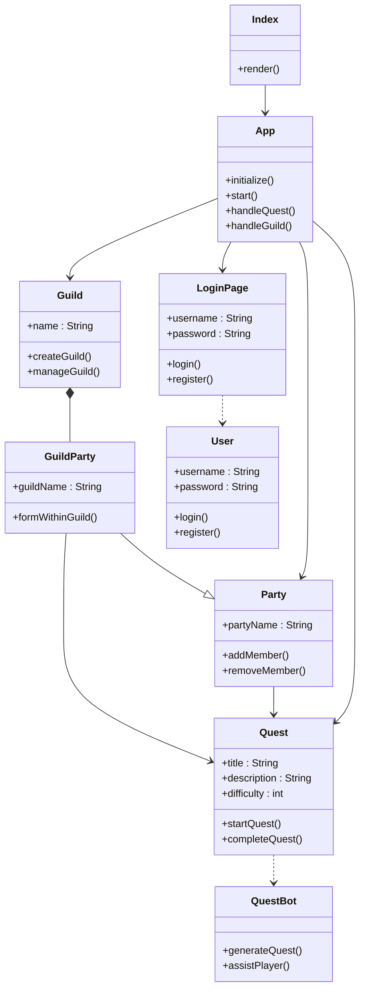

# Class Diagrams

## Frontend Class Diagram

Figure 1:

### Description

- This class diagram models the core components of the Devs and Dragons application and their relationships. The App class acts as the central controller, interacting with key entities such as Quest, Guild, Party, and LoginPage, facilitating the management of quests, guilds, and user sessions. The Index class serves as the entry point, rendering the application. LoginPage class handles user authentication through the User class, which manages login and registration functionality. The QuestBot class generates quests and assists players, offering coding challenges and guidance during gameplay. The Guild class is responsible for creating and managing guilds, while the Party class oversees member management. The GuildParty class inherits from the Party class, signifying it as a specialized type of party within a guild. Both GuildParty and Party class can initiate quests. The Quest class details each challenge, including title, description, and difficulty, while providing methods for starting and completing quests.
