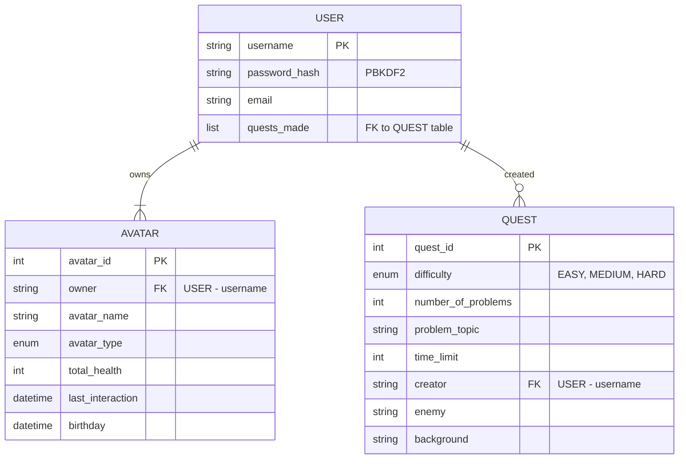

# Database Diagrams

The diagram shows the individual tables and their relations in our MongoDB database. The tables provide this description:

- **USER**: The user holds the core information for the quests he wants to participate in. A user can create multiple quests.
  - USER (many-to-many with QUEST): A USER can create many QUESTs, but each quest belongs to one user as the creator.  

- **AVATAR**: Represents the avatar created and owned by the user. Each avatar belongs to only one user.  
  - AVATAR (many-to-one with USER): One USER can own many avatars.

- **QUEST**: Contains information about quests. A user creates a quest.  
  - QUEST (many-to-one with USER): Each QUEST is created by one USER.  

  

  
