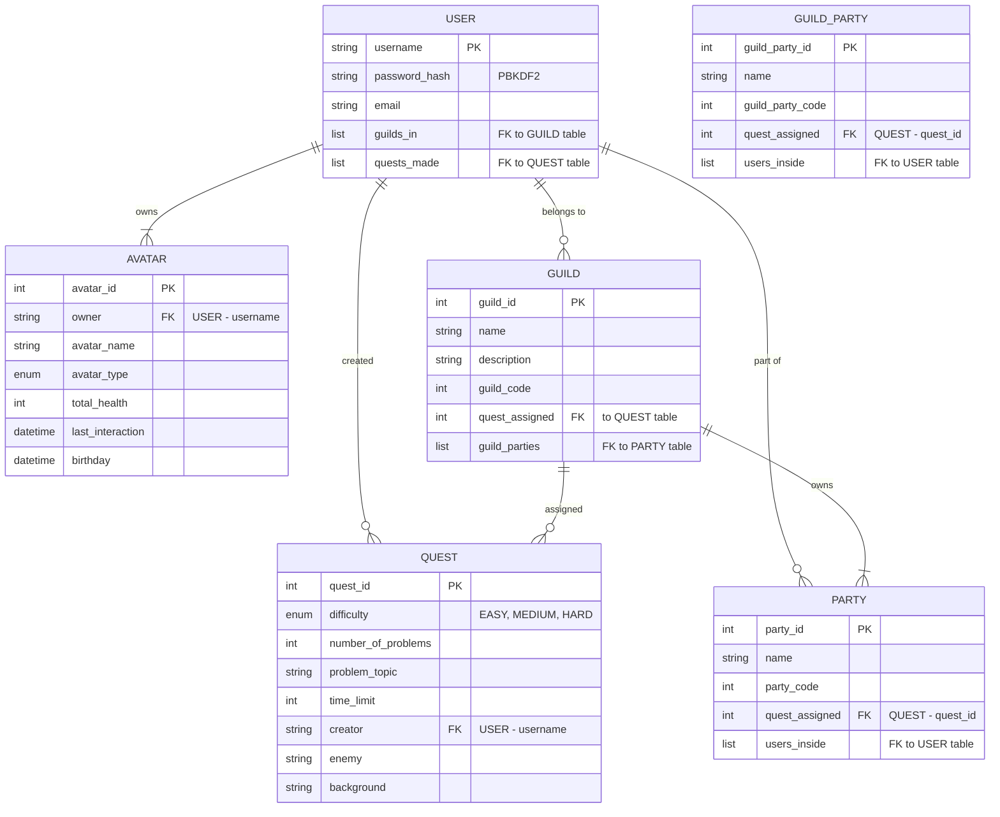

# Database Diagrams

The diagram shows the individual tables and their relations in our MongoDB database. The tables provide this description:

- **USER**: The user holds the core information for users who participate in quests and guilds. A user can create quests, be part of multiple guilds, and belong to multiple parties.  
  - USER (many-to-many with GUILD): A USER can belong to many GUILDs.  
  - USER (many-to-many with QUEST): A USER can create many QUESTs, but each quest belongs to one user as the creator.  
  - USER (many-to-many with PARTY): A USER can be part of multiple PARTYs.

- **AVATAR**: Represents the avatar created and owned by the user. Each avatar belongs to only one user.  
  - AVATAR (many-to-one with USER): One USER can own many avatars.

- **QUEST**: Contains information about quests. A quest is created by a user and can be assigned to guilds and parties.  
  - QUEST (many-to-one with USER): Each QUEST is created by one USER.  
  - QUEST (many-to-many with GUILD): A QUEST can be assigned to many GUILDs, and each GUILD can have many quests assigned to it.  
  - QUEST (one-to-one with PARTY): Each PARTY can be assigned one QUEST, and each QUEST can have one PARTY associated with it.

- **GUILD**: Represents a group that users can join. A guild can assign quests and have multiple parties inside.  
  - GUILD (many-to-many with USER): A GUILD can have many USERs, and each USER can be in many GUILDs.  
  - GUILD (many-to-many with QUEST): A GUILD can assign multiple QUESTs, and each quest can be assigned to multiple GUILDs.

- **PARTY**: Represents a group of users within a guild that works together on a quest. Each party is assigned to one quest and contains several users.  
  - PARTY (many-to-many with USER): A PARTY can have many USERs, and each USER can belong to multiple parties.  
  - PARTY (one-to-one with QUEST): Each PARTY is assigned to exactly one QUEST.  
  - PARTY (many-to-one with GUILD): A PARTY belongs to one GUILD, but a GUILD can have many PARTYs.

- **GUILD_PARTY**: A subset of parties within a guild. Similar to the party entity but specific to the guild.  
  - GUILD_PARTY (many-to-many with USER): A GUILD_PARTY can have many USERs inside it, and each USER can be part of multiple guild parties.  
  - GUILD_PARTY (one-to-one with QUEST): A GUILD_PARTY is assigned to exactly one QUEST.  
  - GUILD_PARTY (many-to-one with GUILD): A GUILD_PARTY belongs to one GUILD, but a GUILD can have multiple guild parties.
  

  
