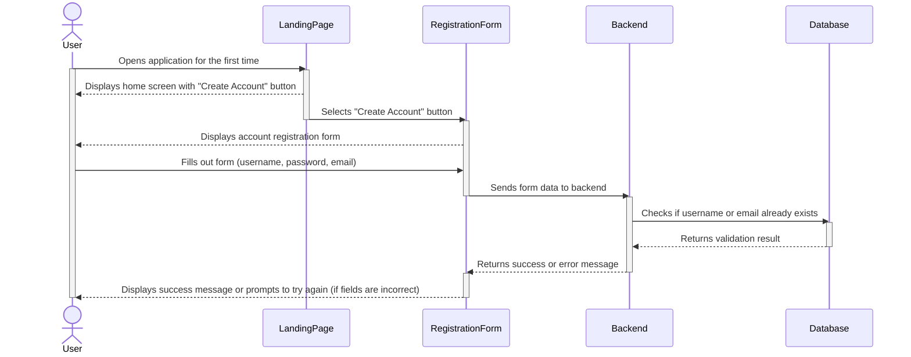
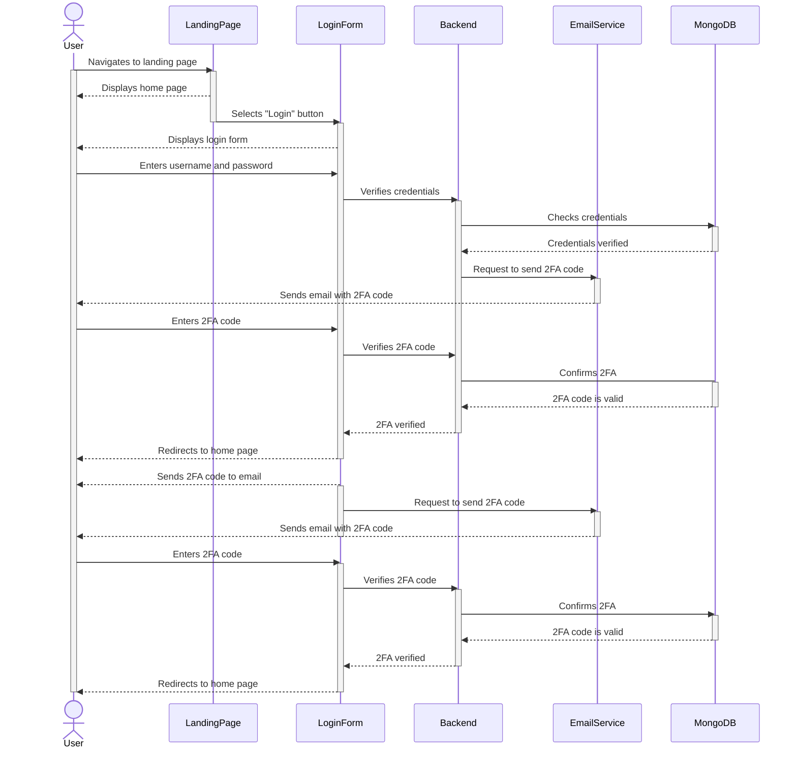
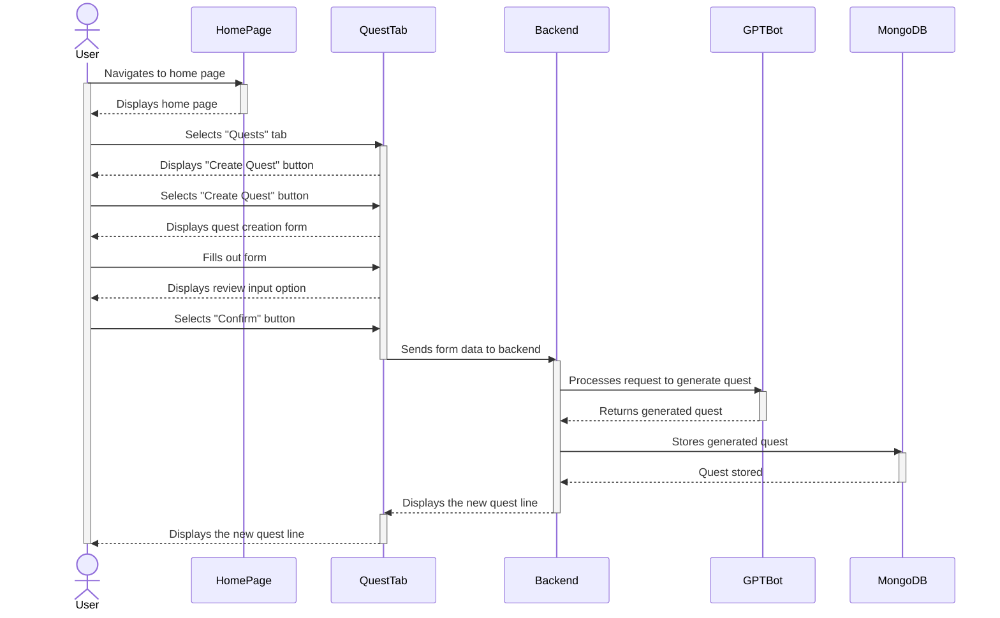
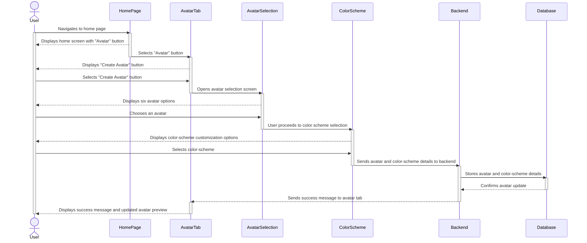
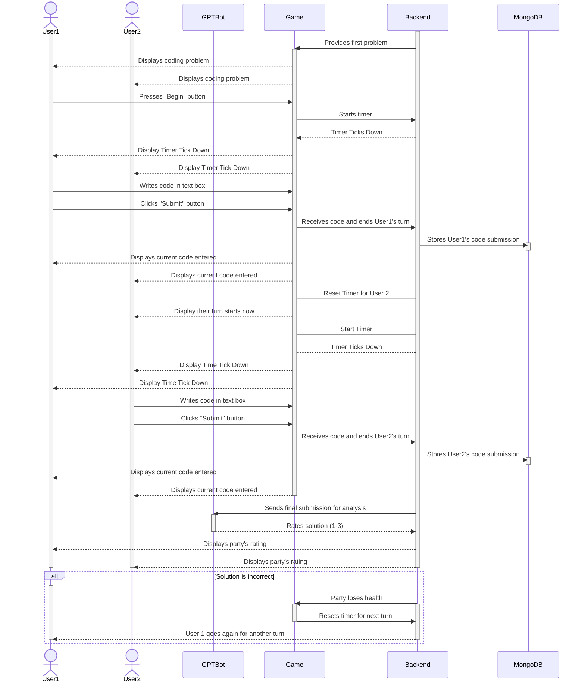

# Sequence Diagrams

## Use Case 1 - Account Creation
**A user wants to create a new account.**

  1. The user opens the Devs & Dragons application for the first time.
  2. The user selects the ‘Create Account’ button to begin the account registration process.
  3. The user enters the desired username, password, and email into the form.
  4. If any fields are filled out incorrectly, the user is notified and asked to try again.

## Use Case 2 - Logging in
**A user wants to log in to an account they created**

1. The user navigates to the site's landing page
2. The user selects the ‘login’ button
3. The user enters their username and password
4. After providing the correct credentials, the user will receive a 2FA code in their email
5. The user enters the 2FA code
6. After providing the correct 2FA code, the user is brought to the home page

## Use Case 3 - Quest Creation
**A user wants to create a new quest.**

1. From the home page, the user selects the “Quests” tab.
2. The user selects the “Create Quest” button.
3. The user fills out a form for the following:
   - Quest Title
   - Coding Topic
   - Amount of problems
   - Difficulty level
   - Enemy
   - Background
4. User reviews their input and selects the “Confirm” button.

## Use Case 4 - Create Avatar
**A user wants to create their Avatar.**

1. From the homepage, the user selects "Avatar" tab.
2. The user selects between six avatar options.
3. The user selects a color-scheme for the selected avatar.
4. User selects "Save Changes" button.

## Use Case 12 - Solving a Problem in a Quest (gameplay)
**Two users want to solve a coding problem together during a quest.**

1. The users are given their first problem.
2. User 1 is randomly selected and when the party is done reading the problem, user 1 presses the “Begin” button.
3. The timer begins and user 1 starts to write code in the provided text box.
4. User 1 clicks the “Submit” button.
5. User 1’s turn is done and the timer restarts.
6. The timer begins as it is now user 2's turn to write code in the provided text box.
7. User 2 clicks the “Submit” button.
8. GPT-bot analyzes the final submission and rates the party’s solution from 1 to 3.
9. If the final submission is incorrect, the party loses health, the timer resets, and user 1 starts a new turn.
