# Sequence Diagrams

## Use Case 1 - Account Creation
**A user wants to create a new account.**

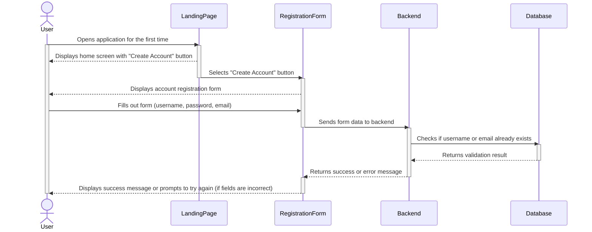

  1. The user opens the Devs & Dragons application for the first time.
  2. The user selects the ‘Create Account’ button to begin the account registration process.
  3. The user enters the desired username, password, and email into the form.
  4. If any fields are filled out incorrectly, the user is notified and asked to try again.

## Use Case 2 - Logging in
**A user wants to log in to an account they created**

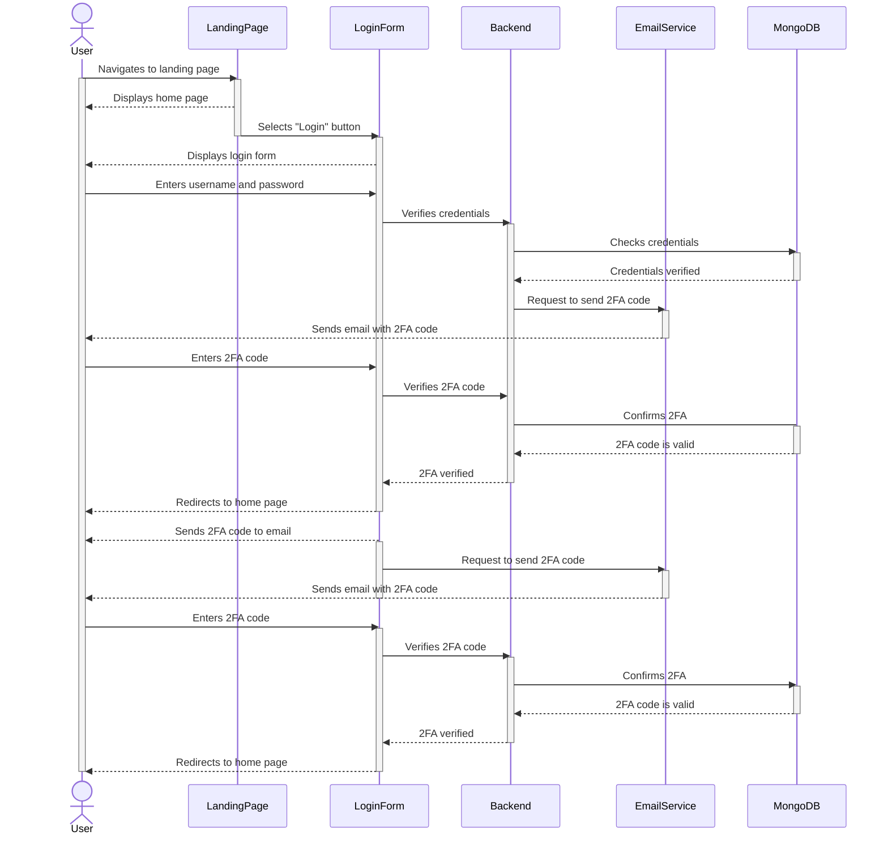
1. The user navigates to the site's landing page
2. The user selects the ‘login’ button
3. The user enters their username and password
4. After providing the correct credentials, the user will receive a 2FA code in their email
5. The user enters the 2FA code
6. After providing the correct 2FA code, the user is brought to the home page

## Use Case 3 - Quest Creation
**A user wants to create a new quest.**

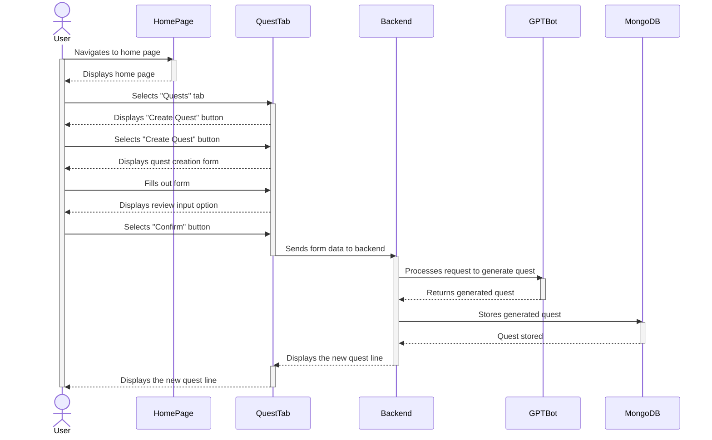

1. From the home page, the user selects the “Quests” tab.
2. The user selects the “Create Quest” button.
3. The user fills out a form for the following:
   - Quest Title
   - Coding Topic
   - Amount of problems
   - Difficulty level
   - Enemy
   - Background
4. User reviews their input and selects the “Confirm” button.

## Use Case 4 - Create Avatar
**A user wants to create their Avatar.**
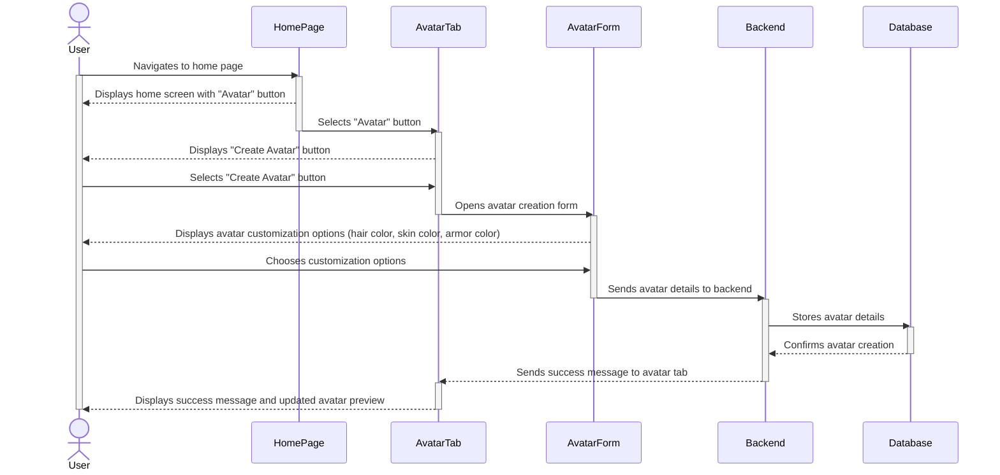
1. From the homepage, the user selects "Avatar" tab.
2. The user selects between three avatar options.
3. The user selects the different customization options for the following:
   - Hair color
   - Skin color
   - Armor color
4. User selects "Save Changes" button.

## Use Case 5 - Adding a Friend
**Two users want to add one another to their friends list.**

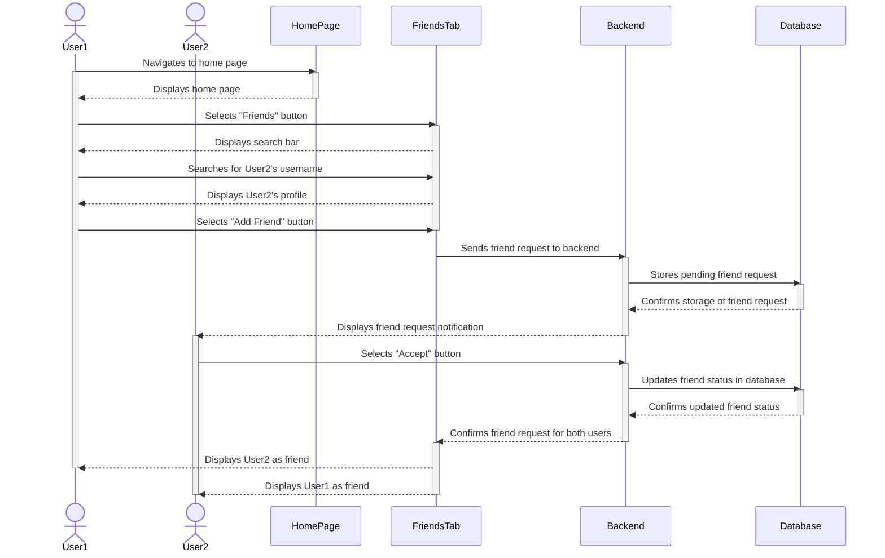

1. From the home page, the user selects the “Friends” button.
2. User 1 navigates to the search bar and types User 2’s username.
3. User 1 selects User 2’s profile.
4. User 1 selects the “Add Friend” button.
5. User 2 receives the request and selects “Accept”.

## Use Case 6 - Creating a Party to Start a Quest Outside of a Guild
**A user wants to start a quest outside of a guild.**

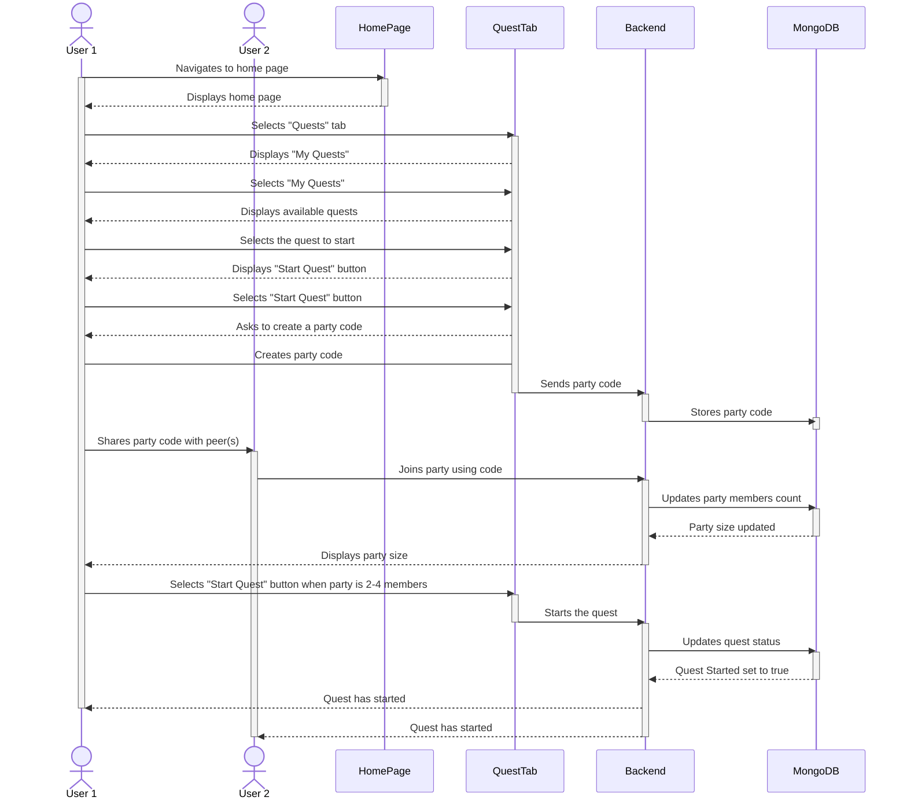
1. From the home page, the user selects the “Quests” tab.
2. The user selects “My Quests”.
3. The user selects the quest they want to do.
4. The user selects the “Start Quest” button.
5. The user creates a party code and shares it with their peer(s).
6. The user waits for party size to be at two to four members, then clicks the “Start Quest” button.

## Use Case 7 - Join a Party
**A user wants to join another user’s party.**

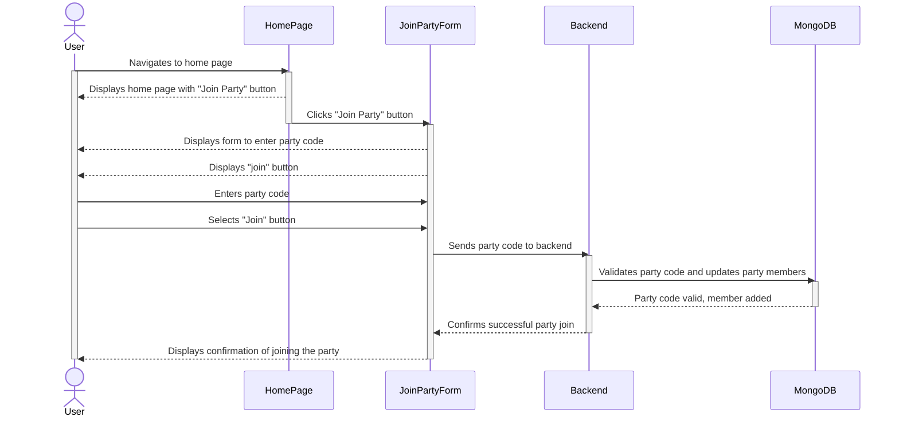
1. From the home page, the user clicks on the “Join Party” button.
2. The user enters the party code.
3. The user selects the “Join” button.

## Use Case 8 - Guild Creation
**A user wants to create a guild.**

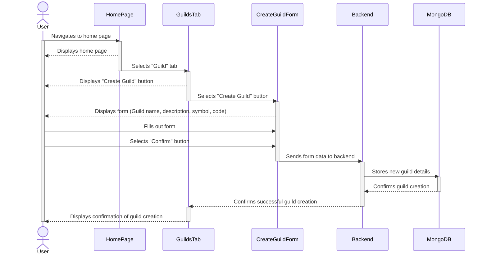

1. From the home page, the user selects the “Guilds” tab.
2. The user selects the “Create Guild” button.
3. The user fills out a form for the following:
   - Guild name
   - Guild description
   - Guild symbol
   - Guild Code
4. The user reviews their input and selects “confirm”.

## Use Case 9 - Assign Quest to Guild
**A user wants to assign a quest for their guild to complete**

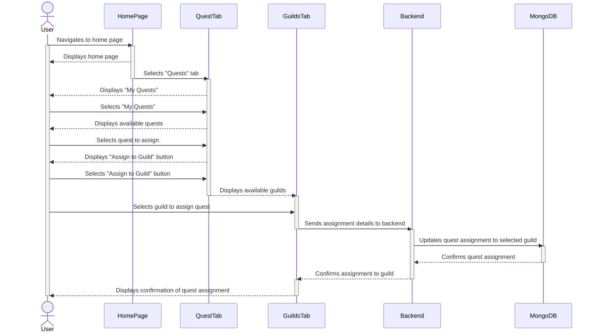
1. From the home page, the user selects the “Quests” tab.
2. The user selects “My Quests”.
3. The user selects the quest they want to assign.
4. The user selects the “Assign to Guild” button.
5. The user selects the guild to assign the quest to.

## Use Case 10 - Join a Guild
**A user wants to join another user’s guild.**

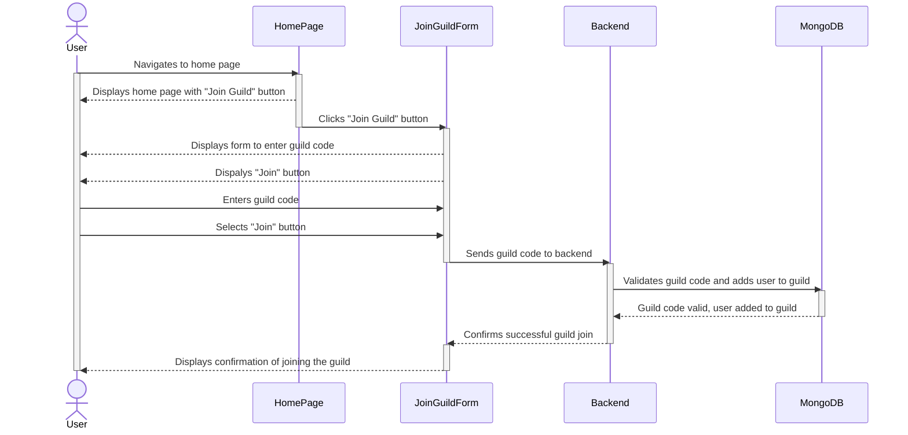

1. From the home page, the user clicks on the “Join Guild” button.
2. The user enters the guild code.
3. The user selects “Join” button.

## Use Case 11 - Creating a Guild Party To Start a Quest
**A user wants to start a quest inside a guild.**

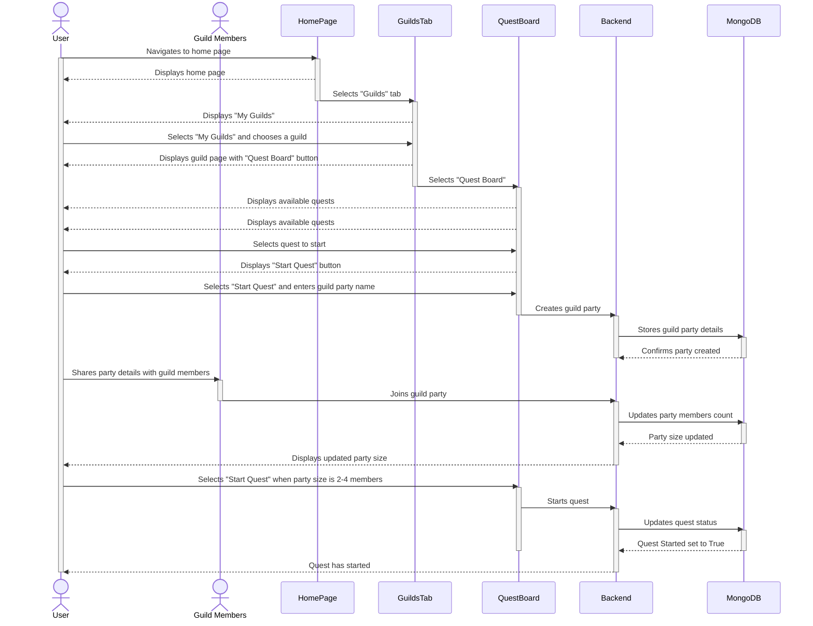

1. From the home page, the user selects “Guilds” tab.
2. The user selects “My Guilds” and then selects the guild they wish to start a quest in.
3. In the guild, the user selects the “Quest Board” button.
4. The user selects a quest they want to do.
5. The user selects “Start Quest” which creates a guild party.
6. The user enters a name for the guild party.
7. User waits for the guild party size to be at two to four members, then selects the “Start Quest” button.

## Use Case 12 - Solving a Problem in a Quest (gameplay)
**Two users want to solve a coding problem together during a quest.**

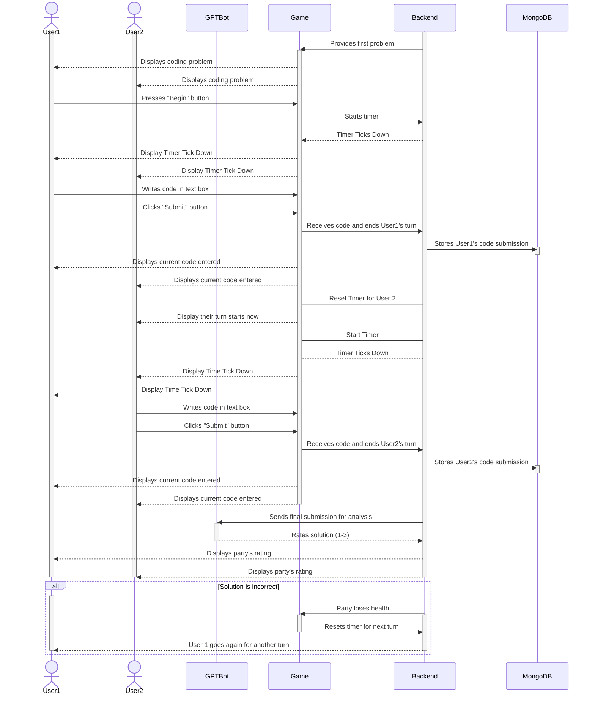

1. The users are given their first problem.
2. User 1 is randomly selected and when the party is done reading the problem, user 1 presses the “Begin” button.
3. The timer begins and user 1 starts to write code in the provided text box.
4. User 1 clicks the “Submit” button.
5. User 1’s turn is done and the timer restarts.
6. The timer begins as it is now user 2's turn to write code in the provided text box.
7. User 2 clicks the “Submit” button.
8. GPT-bot analyzes the final submission and rates the party’s solution from 1 to 3.
9. If the final submission is incorrect, the party loses health, the timer resets, and user 1 starts a new turn.
