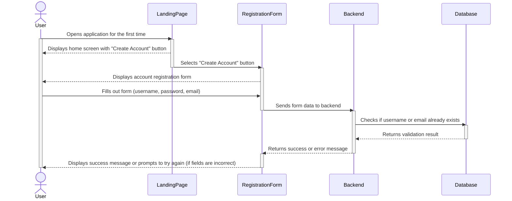
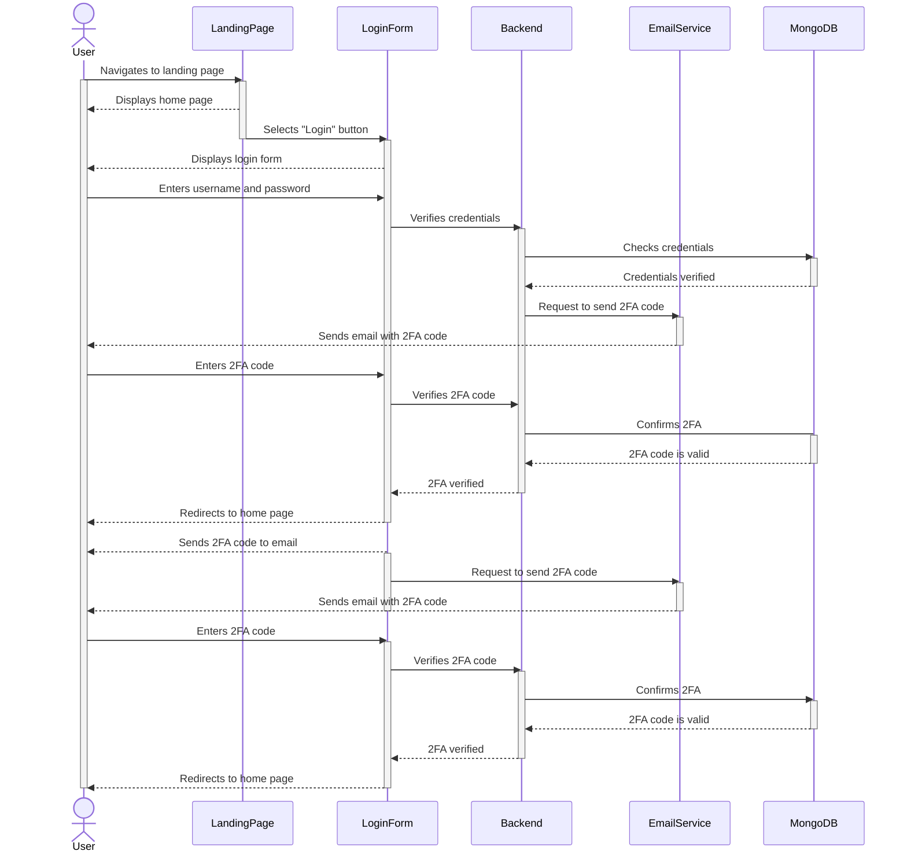
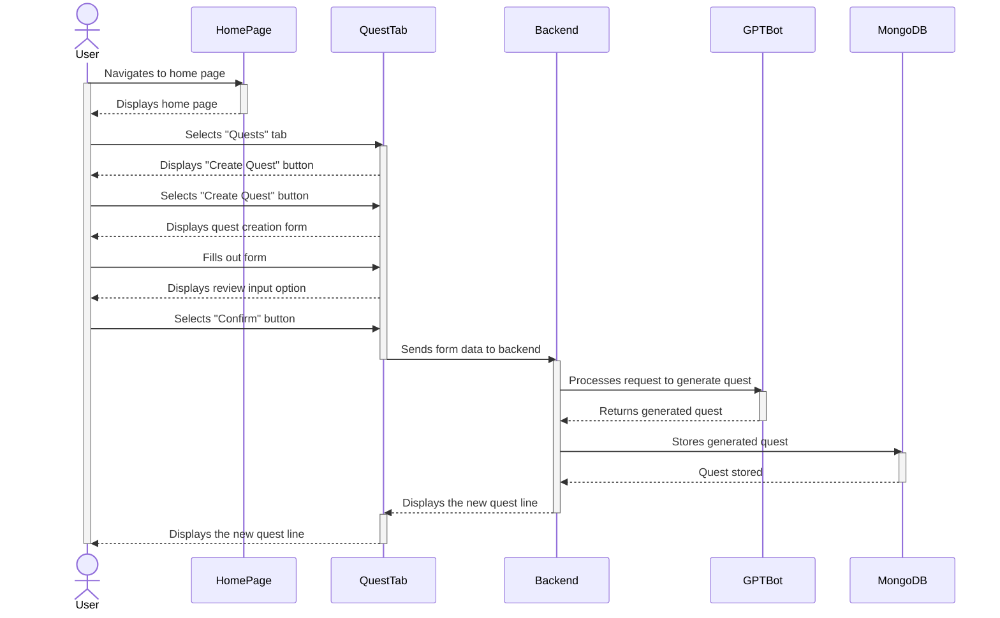
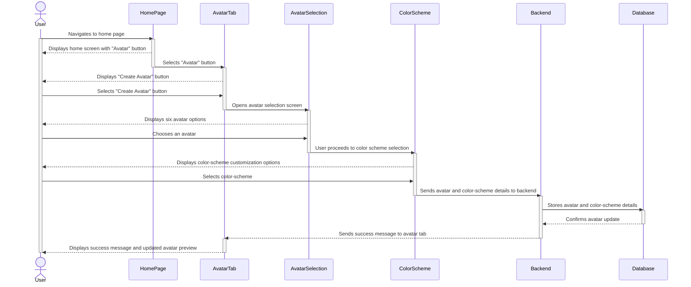
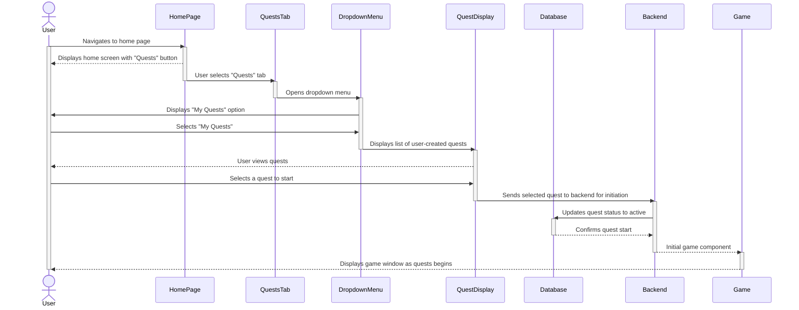
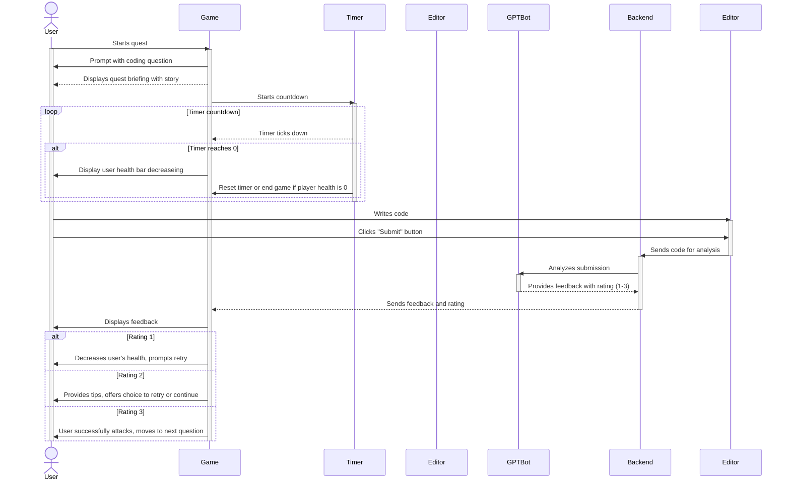
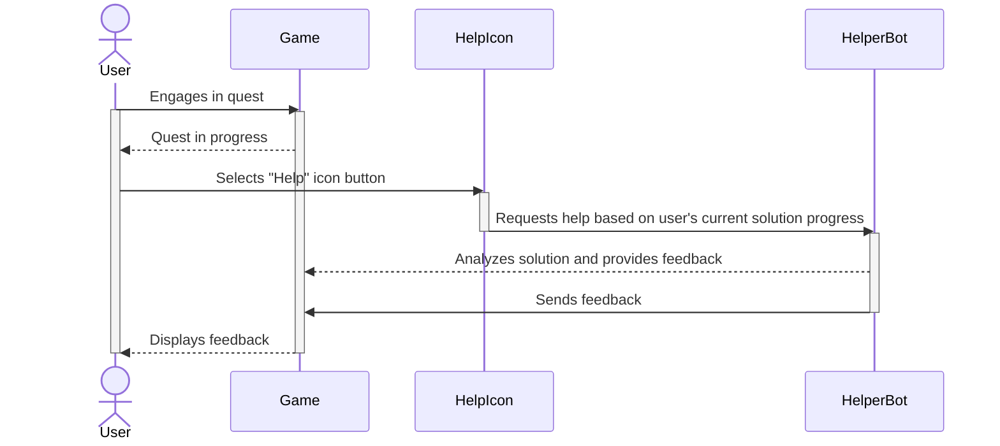

# Sequence Diagrams

## Use Case 1 - Account Creation
**A user wants to create a new account.**

  1. The user opens the Devs & Dragons application for the first time.
  2. The user selects the ‘Create Account’ button to begin the account registration process.
  3. The user enters the desired username, password, and email into the form.
  4. If any fields are filled out incorrectly, the user is notified and asked to try again.

## Use Case 2 - Logging in
**A user wants to log in to an account they created**

1. The user navigates to the site's landing page
2. The user selects the ‘login’ button
3. The user enters their username and password
4. After providing the correct credentials, the user will receive a 2FA code in their email
5. The user enters the 2FA code
6. After providing the correct 2FA code, the user is brought to the home page

## Use Case 3 - Quest Creation
**A user wants to create a new quest.**

1. From the home page, the user selects the “Quests” tab.
2. The user selects the “Create Quest” button.
3. The user fills out a form for the following:
   - Quest Title
   - Coding Topic
   - Amount of problems
   - Difficulty level
   - Enemy
   - Background
4. User reviews their input and selects the “Confirm” button.

## Use Case 4 - Create Avatar
**A user wants to create their Avatar.**

1. From the homepage, the user selects "Avatar" tab.
2. The user selects between six avatar options.
3. The user selects a color-scheme for the selected avatar.
4. User selects "Save Changes" button.

## Use Case 5 - Starting a Quest
**A user wants to start a quest they made.**

1. From the homepage, the user selects "Quests" tab.
2. The user selects the dropdown menu option, "My Quests."
3. The quests the user made are displayed, the user selects the quests interested in starting.
4. The user selects "Start Quest" button.

## Use Case 6 - Solving a Problem in a Quest (gameplay)
**Two users want to solve a coding problem together during a quest.**

1. The quest begins by displaying the quest briefing to the user, providing a story for the user.
2. The game screen is now displayed to the user where they can see:
   - User's avatar
   - User's health bar
   - Enemy
   - Enemy's health bar
   - Timer
   - Code Editor
3. The user is prompted with a question.
4. The timer begins to tick down.
   - If the user does not submit an answer before the timer reaches 0, then the user's health bar decreases.
5. The user writes code in the provided code editor.
6. The user clicks the "Submit" button.
7. The GPT-bot analyzes the user's submission and provides feedback with a rating from 1 to 3.
8. Based on the GPT-bot’s rating:
   - **Feedback is provided to the user**:
     - If the rating is 1, the user’s health bar decreases, and the quest continues with the timer reset for a new attempt.
     - If the rating is 2, the user receives tips on improving their solution and chooses to try again or continue.
     - If the rating is 3, the user successfully damages the enemy, the enemy’s health bar decreases, and the user proceeds to the next question if available.
9. The user continues to engage with the quest until all questions are answered, the enemy is defeated, the user quits, or the user’s health bar reaches zero.

## Use Case 7 - Recieve help from helper bot.
**A user wants to get help from the helper bot.**

1. During the quest, the user selects the "Help" icon button.
2. The helper bot analyzes the current progress of the user's solution to the question and provides feedback.
3. The feedback is displayed to the user.